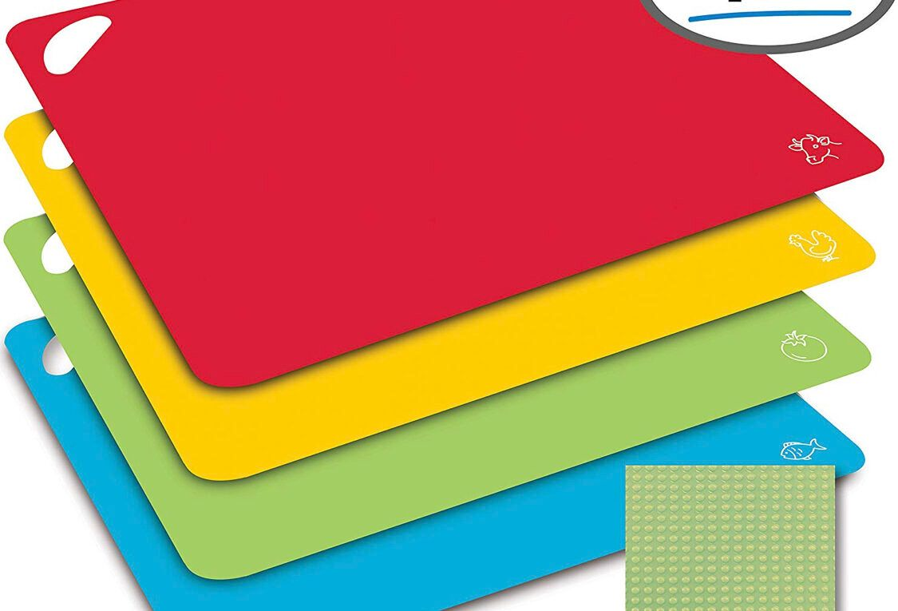

# How to find a cutting board

This section will show you where to find a cutting board, and keep in mind you may need multiple so return whenever you need to.  The cutting boards are an assortment of colors and look like Figure 1.

[Figure 1](https://img.search.brave.com/pyT3qKPDLNn8bz8D8GbiFfaJJ8-1XHZ2zcmsuiTG-Oo/rs:fit:1125:765:1/g:ce/aHR0cDovL3RoZWNv/dXBvbnRoYW5nLmNv/bS93cC1jb250ZW50/L3VwbG9hZHMvMjAy/MC8wMS9GMEE2OUIw/OS1CNUQxLTRFQzkt/QjRBNy04ODE3MEU4/NUZCNDgtMTEyNXg3/NjUuanBlZw)

## Requirements

- None

## Steps

1. Go stand and face the stove in the kitchen.
2. Open the bottom right drawer touching the stove.
3. Grab a cutting board.
> **Note:** There are two levels; look for a cutting board in the second.

Hopefully you have found the cutting boards! 


